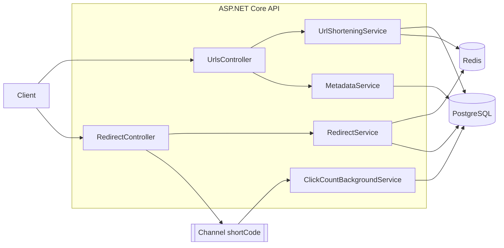
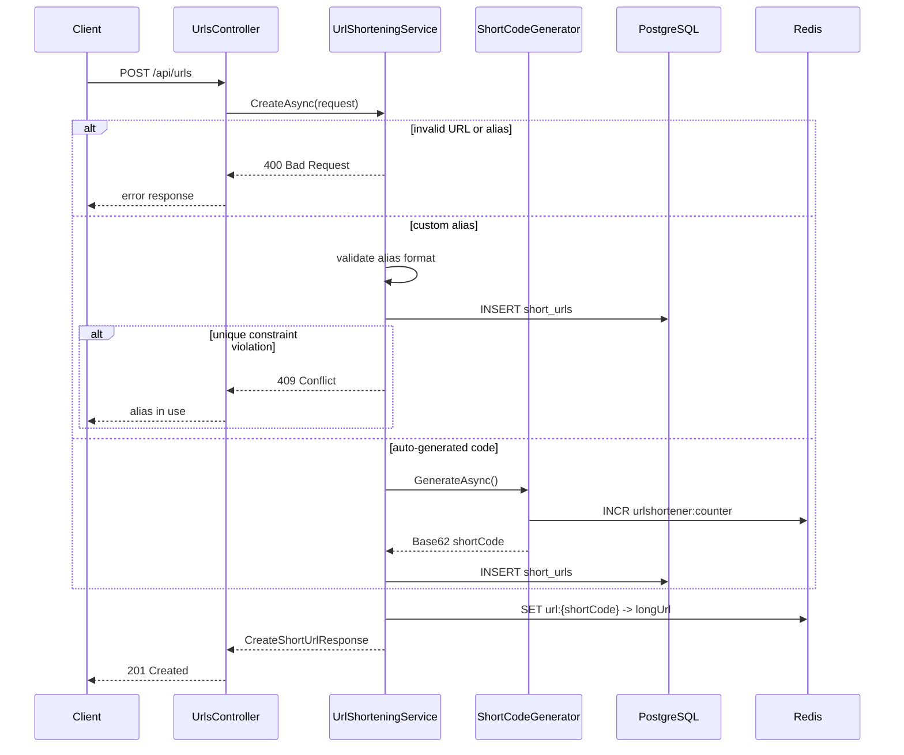
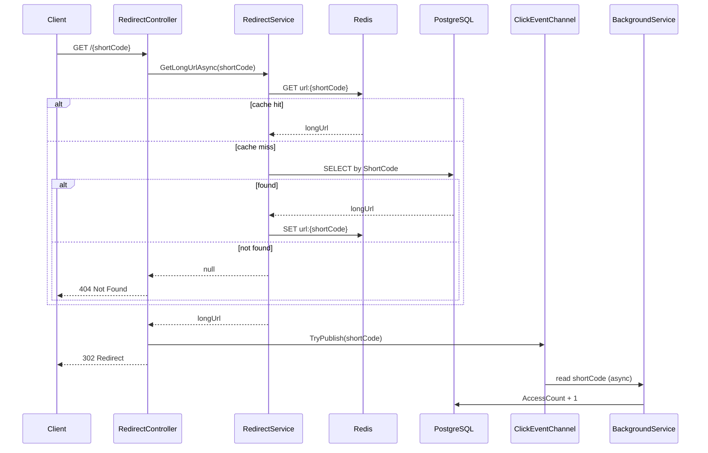
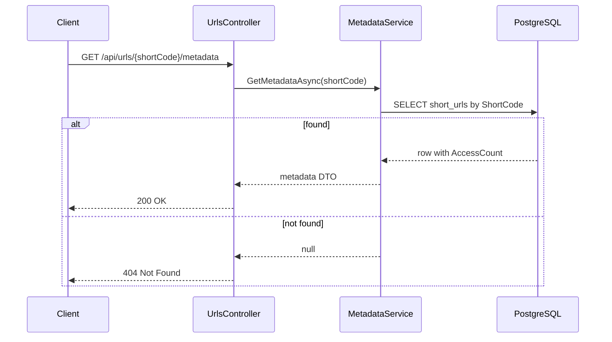

# UrlShortener

A URL shortener built with **.NET 8**, **ASP.NET Core Web API**, **EF Core**, **PostgreSQL**, **Redis**, and async access-count tracking via **`BackgroundService` + `Channel<T>`**.

## Features

- Create short URLs from long URLs
- Support custom aliases
- Handle alias collisions with database unique constraints (`409 Conflict`)
- Auto-generate short codes using Redis counter + Base62
- Fast redirects with Redis cache-aside
- Async access count updates (non-blocking redirects)
- Metadata API for creation time and click counts

## Tech Stack

| Layer | Technology |
|---|---|
| API | ASP.NET Core Web API (.NET 8) |
| ORM | Entity Framework Core 8 |
| Database | PostgreSQL |
| Cache | Redis (StackExchange.Redis) |
| Analytics | `Channel<T>` + `BackgroundService` |
| Tests | xUnit, Moq, EF Core SQLite (in-memory) |

## Project Structure

```text
UrlShortener/
├── UrlShortener.Api/              # Web API
│   ├── Controllers/               # HTTP endpoints
│   ├── Services/                  # Business logic
│   ├── BackgroundJobs/            # Access count worker
│   ├── Persistence/               # EF Core DbContext
│   ├── Entities/                  # Domain entities
│   ├── DTOs/                      # Request/response models
│   └── Migrations/                # EF Core migrations
├── UrlShortener.Api.Tests/        # Unit tests
├── docker-compose.yml             # PostgreSQL + Redis
└── UrlShortener.sln
```

## Prerequisites

- [.NET 8 SDK](https://dotnet.microsoft.com/download/dotnet/8.0)
- PostgreSQL and Redis (via Docker Compose or local install)
- `dotnet-ef` tool (for migrations)

```bash
dotnet tool install --global dotnet-ef
```

## Local Setup

### 1. Start PostgreSQL and Redis

Using Docker Compose:

```bash
docker compose up -d
```

Connection defaults (see `appsettings.json`):

```text
PostgreSQL: Host=localhost;Port=5432;Database=urlshortener;Username=postgres;Password=postgres
Redis:      localhost:6379
```

### 2. Apply database migrations

```bash
dotnet ef database update --project UrlShortener.Api
```

### 3. Run the API

```bash
dotnet run --project UrlShortener.Api --urls "http://0.0.0.0:5279"
```

Swagger UI: `http://localhost:5279/swagger`

> **Dev container note:** Forward port `5279` in the Cursor **Ports** panel to access Swagger from your host browser.

### 4. Run tests

```bash
dotnet test
```

## API Endpoints

### Create short URL

```http
POST /api/urls
Content-Type: application/json

{
  "longUrl": "https://example.com/some/long/path",
  "customAlias": "my-link"
}
```

**Response `201 Created`:**

```json
{
  "shortCode": "my-link",
  "shortUrl": "http://localhost:5279/my-link",
  "longUrl": "https://example.com/some/long/path",
  "createdAtUtc": "2026-06-27T09:00:00Z"
}
```

| Status | When |
|---|---|
| `201` | Short URL created |
| `400` | Invalid URL or alias |
| `409` | Custom alias already in use |

### Redirect

```http
GET /{shortCode}
```

| Status | When |
|---|---|
| `302` | Redirect to original long URL |
| `404` | Short code not found |

### Metadata

```http
GET /api/urls/{shortCode}/metadata
```

**Response `200 OK`:**

```json
{
  "shortCode": "my-link",
  "longUrl": "https://example.com/some/long/path",
  "createdAtUtc": "2026-06-27T09:00:00Z",
  "accessCount": 14
}
```

| Status | When |
|---|---|
| `200` | Metadata found |
| `404` | Short code not found |

## Architecture Overview



## Request Lifecycle

### 1. Create Short URL (`POST /api/urls`)



### 2. Redirect (`GET /{shortCode}`)



### 3. Metadata (`GET /api/urls/{shortCode}/metadata`)



## Data Flow

### Create flow (write path)

```text
longUrl + optional customAlias
        │
        ▼
   UrlShorteningService
        │
        ├─► PostgreSQL (source of truth)
        │     short_urls table
        │     UNIQUE(ShortCode) prevents collisions
        │
        └─► Redis (write-through cache)
              key: url:{shortCode}
              value: longUrl
              TTL: 24 hours
```

### Redirect flow (read path)

```text
GET /{shortCode}
        │
        ▼
   RedirectService
        │
        ├─► Redis lookup (fast path)
        │     hit → return longUrl
        │
        └─► PostgreSQL lookup (cache miss)
              found → cache + return longUrl
              missing → 404
```

### Access count flow (async analytics)

```text
Successful redirect
        │
        ▼
ClickEventChannel.TryPublish(shortCode)   ← non-blocking
        │
        ▼
ClickCountBackgroundService
        │
        ▼
PostgreSQL: AccessCount = AccessCount + 1
```

## Data Model

**Table:** `short_urls`

| Column | Type | Notes |
|---|---|---|
| `Id` | uuid | Primary key |
| `ShortCode` | varchar(32) | Unique index |
| `LongUrl` | varchar(2048) | Original URL |
| `IsCustomAlias` | boolean | Custom vs generated |
| `CreatedAtUtc` | timestamptz | Creation time |
| `AccessCount` | bigint | Updated async on redirect |
| `ExpiresAtUtc` | timestamptz | Optional (nullable) |

## Configuration

`appsettings.json`:

```json
{
  "ConnectionStrings": {
    "Postgres": "Host=localhost;Port=5432;Database=urlshortener;Username=postgres;Password=postgres",
    "Redis": "localhost:6379"
  },
  "ShortUrl": {
    "BaseUrl": "http://localhost:5279"
  }
}
```

| Setting | Purpose |
|---|---|
| `ConnectionStrings:Postgres` | PostgreSQL connection |
| `ConnectionStrings:Redis` | Redis connection |
| `ShortUrl:BaseUrl` | Base URL used when building short links |

## Example cURL Commands

```bash
# Create with custom alias
curl -X POST http://localhost:5279/api/urls \
  -H "Content-Type: application/json" \
  -d '{"longUrl":"https://example.com","customAlias":"demo"}'

# Create with auto-generated code
curl -X POST http://localhost:5279/api/urls \
  -H "Content-Type: application/json" \
  -d '{"longUrl":"https://example.com/page"}'

# Redirect (follow with -L)
curl -I http://localhost:5279/demo

# Metadata
curl http://localhost:5279/api/urls/demo/metadata
```

## Collision Handling

Custom alias collisions are handled at the database layer:

1. Insert directly into PostgreSQL (no check-then-insert race).
2. Unique index on `ShortCode` ensures only one request wins.
3. Loser receives `409 Conflict`.

Auto-generated codes use a Redis atomic counter, so collisions are extremely unlikely.

## License

MIT (or your preferred license)
